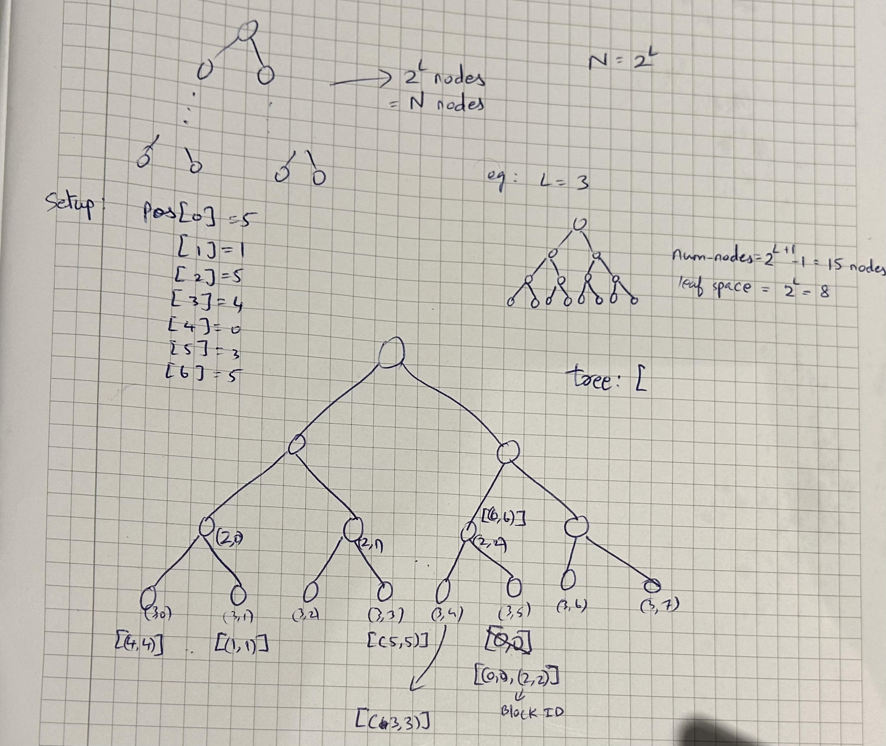

# Objective:
The purpose of this project is to implement and assess a Path ORAM (Oblivious RAM) storage system.  
The experiment examines how the stash size behaves over a large number of operations, for two configurations with bucket sizes Z=2 and Z=4.  
From this data, we estimate the probability P[size(S) > R].

Sample initialization of tree:

# Implementation summary:
The simulation is implemented in the script path oram sim py38.py. 
The code builds a binary ORAM tree of height L, 
then performs random read and write operations on N blocks.

# Findings
The resulting graph displays the probability P [size(S) > R] for various values
of R with both Z = 2 and Z = 4. A logarithmic scale was used for the y-axis to better
visualize the tail of the distribution. The probability of stash overflow dropped significantly as R increased.  
A larger bucket size Z = 4 results in a much smaller probability of stash overflow than Z = 2.  
For Z = 4, the overflow probability becomes negligible when R is approximately 10.  
For Z = 2, there is still a significant probability of overflow when R is approximately 900.
